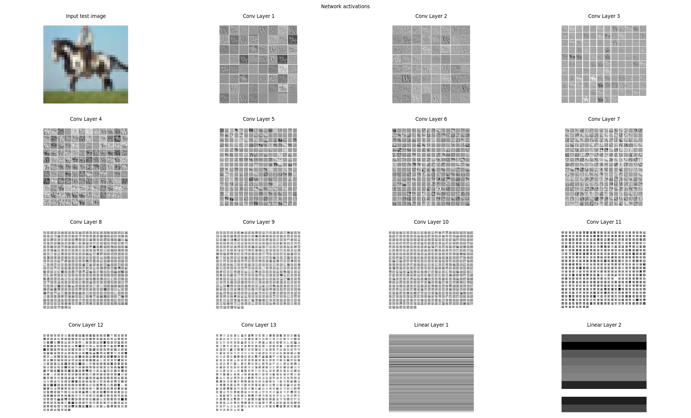
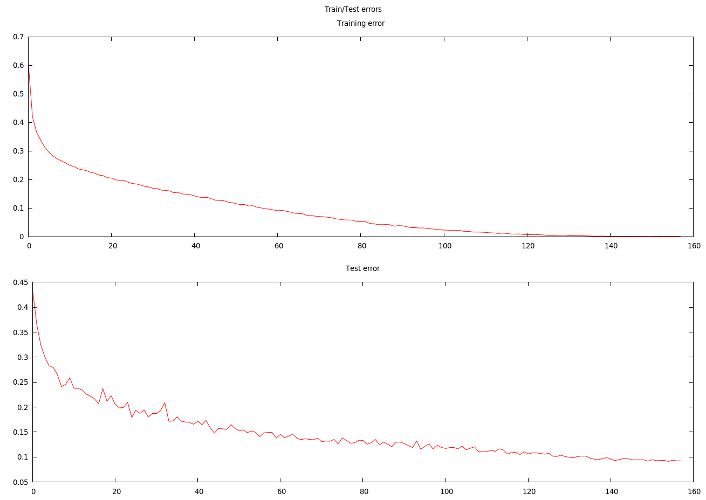
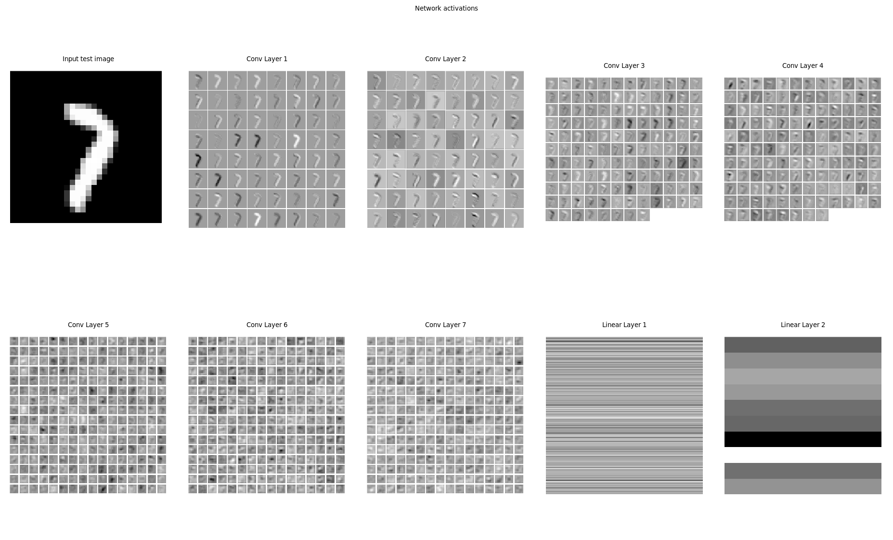

# Kumozu
Kumozu is research software for deep learning and matrix factorization algorithms.


#### Features

* Includes a multi-dimensional matrix class template (`Matrix`), various utility functions in `Utilities.h`, and layer classes such as fully-connected, convolutional, batch normalization, dropout, etc. for constructing deep convolutional and feed-forward networks.

* Support for general computation graphs using the base graph `Node` class. A node can have an arbitrary number of named input and output ports and can itself contain a subgraph of other Node instances, enabling expressive architectures such as recurrent neural networks. Kumozu is different from other frameworks in that it supports descriptive string-valued port names, rather than positional or integer-valued names. This is intended to improve code readability and reduce the chance of user error when making port connections between nodes.

* Recurrent neural networks (RNNs) are supported by two features: shared parameters (`set_shared()` member function of `Node` class) and the `SliceUnroller` class, which automatically unrolls the computation sub-graph for a single RNN time slice a specified number of times so that truncated backpropagation through time can be performed. See `ExamplesRNN.cpp` for examples.

* The user only needs to specify the sizes of the input activations for the first layer in a deep network. All other layers will automatically determine their required input sizes as the network is initialized during the first forward pass of the back-propagation procedure. This makes it easy to create and modify very deep networks without needing to manually determine the required dimensions for the input activations at each layer. For example, the removal of a max-pooling layer from the middle of a deep network will cause the activation sizes to change for all downstream layers. In this framework, such a layer can often be removed by just commenting out a single line of code since the downstream layers will automatically determine their required activation sizes at runtime.

* Data visualization using Gnuplot. Activations, layer weights, and various statistics can be plotted and refreshed as frequently as desired during network training.

* Written in a modern C++ style with few dependencies. The code should compile with little modification on most platforms that support C++11. An optimized BLAS implementation is highly recommended, though.

* Uses OpenBLAS sgemm to perform the matrix multiplications and optimized convolutions using the method described [here](http://citeseerx.ist.psu.edu/viewdoc/download?doi=10.1.1.137.482&rep=rep1&type=pdf). This method can use a bit more memory than the naive method but is often much faster. This makes it fast enough to experiment with datasets such as MNIST and CIFAR in a reasonable amount of time (if you have a fast CPU).

* Any node/layer in a network (including the whole network) can use the Jacobian checker that is included in the base `Node` class. This makes it easy to verify that a network or newly-created node is computing its gradients correctly.


#### Limitations

* No GPU support. A design goal is to keep the code base as simple, efficient, and as platform agnostic as possible (ideally only requiring a compiler with C++11 support and a BLAS-optimized sgemm function), which currently seems to be at odds with adding GPU support.

* Limited file IO capability. Currently, only a few C++ and Python functions are provided to load/save float-type multi-dimensional arrays to disk. This makes it possible to easily move multi-dimensional array data between Python scripts and the C++ code. No support for csv/text-formated files yet.


#### Requirements

This software was developed under Ubuntu 16.04.

g++-4.9 or newer is required. Therefore, the default 4.8 version used by Ubuntu 14.04 will not work.

Install OpenBLAS from source and add the library path to `LD_LIBRARY_PATH` environment variable. The makefile assumes the install location is `/opt/OpenBLAS/lib`. It is important to build OpenBLAS from source so that it can optimize itself to your specific CPU. Build with:

```
git clone https://github.com/xianyi/OpenBLAS.git
cd OpenBLAS
make USE_OPENMP=1
sudo make install
```

Python is used only for loading the datasets for some of the examples. Either install a scientific python distribution such as [Anaconda](https://store.continuum.io/cshop/anaconda/) or manually install Python 2.7.x, Scipy, Numpy, Matplotlib, etc.

Install Boost (optional, which is a dependency for Gnuplot.

```
sudo apt-get install libboost-all-dev
```

Install Gnuplot:

```
sudo apt-get install gnuplot
sudo apt-get install gnuplot-x11
```

#### Instalation

`cd` to `kumozu\src_cpp` folder and open **makefile** in an editor. Edit the library and include paths to point to the locations of OpenBLAS and Boost library and include folders if different than Ubuntu 14.04 defaults.

Open main.cpp and set ```<number of threads>``` in

```C++
omp_set_num_threads(<number of threads>);
```
to the desired number of threads, typically the same as the number of cores in your CPU. Build the **main** executable:

```
make -j8
```

Then run the unit tests to make sure there are no errors:

```
./main test
```

Then run the matrix multiplication benchmark to make sure the OpenBLAS library gives the expected FLOPS performance.

```
./main matrix_mult_benchmark
```

The result should probably be in the 100s of GFLOPS for a recent CPU. On a Core i7 5960X desktop, I get 692 GFLOPS.


#### Running the examples

##### Matrix examples

To see some examples of how to use the `Matrix` class and some utility functions from `Utilities.h`, type

```
cd kumozu/src_cpp
./main matrix_examples
```

which will output:

```c++
// 3 x 4 matrix, initialized to 0.
MatrixF X(3,4);
cout << X << endl;
0  0  0  0  
0  0  0  0  
0  0  0  0  

// Create range of values in X.
float i = 0;
// Fill up X.
apply_sequential(X, [&] (float a) {
        // Ignore the value of a.
        i += 0.1f;
        return i;
      });
cout << X << endl;
0.1  0.2  0.3  0.4  
0.5  0.6  0.7  0.8  
0.9  1  1.1  1.2  

// Apply sqrt() to all elements in X.
apply(X, [] (float a) {
        return std::sqrt(a);
      });
cout << X << endl;
0.316228  0.447214  0.547723  0.632456  
0.707107  0.774597  0.83666  0.894427  
0.948683  1  1.04881  1.09545  

MatrixF Y(4,5);
cout << Y << endl;
0  0  0  0  0  
0  0  0  0  0  
0  0  0  0  0  
0  0  0  0  0  

i = 0;
apply_sequential(Y, [&] (float a) {
        // Ignore the value of a.
        i += 1.0f;
        return i;
      });

// map2() example:
cout << Y << endl;
1  2  3  4  5  
6  7  8  9  10  
11  12  13  14  15  
16  17  18  19  20  

MatrixF A = Y;
cout << A << endl;
1  2  3  4  5  
6  7  8  9  10  
11  12  13  14  15  
16  17  18  19  20  

MatrixF B = Y;
cout << B << endl;
1  2  3  4  5  
6  7  8  9  10  
11  12  13  14  15  
16  17  18  19  20  

// Apply map2():
map2(Y, A, B, [] (float a, float b) {
        return a + 2*b;
      });

cout << Y << endl;
3  6  9  12  15  
18  21  24  27  30  
33  36  39  42  45  
48  51  54  57  60  

// narrow() example:
apply_sequential(Y, [&] (float a) {
        // Ignore the value of a.
        i += 1.0f;
        return i;
      });
cout << Y << endl;
1  2  3  4  5  
6  7  8  9  10  
11  12  13  14  15  
16  17  18  19  20  

MatrixF D = narrow(Y, 1, 1, 2);
cout << D << endl;
2  3  
7  8  
12  13  
17  18  

// Now randomize D:
randomize_normal(D, 1.0f, 1.0f);
cout << D << endl;
-0.129852  0.801642  
0.867439  0.0679137  
1.4003  -1.15137  
-0.828092  -1.2349  

// Now copy data from D back into same locations in Y:
reverse_narrow(D, Y, 1, 1, 2);
cout << Y << endl;
1  -0.129852  0.801642  4  5  
6  0.867439  0.0679137  9  10  
11  1.4003  -1.15137  14  15  
16  -0.828092  -1.2349  19  20  

// Matrix multilication example:
MatrixF U(3,4);
cout << U << endl;
0  0  0  0  
0  0  0  0  
0  0  0  0  

randomize_uniform(U, -1.0f, 1.0f);
cout << U << endl;
0.447536  -0.00622427  0.536378  0.118789  
0.48407  0.723935  0.730844  -0.566613  
-0.784256  -0.58828  -0.336768  0.630088  

MatrixF R(4,5);
cout << R << endl;
0  0  0  0  0  
0  0  0  0  0  
0  0  0  0  0  
0  0  0  0  0  

set_value(R, 1.0f);
cout << R << endl;
1  1  1  1  1  
1  1  1  1  1  
1  1  1  1  1  
1  1  1  1  1  

// Compute C = U*R:
MatrixF C;
// Note: C has not been initialized to the required output dimensions but will be
// resized to the correct dimensions inside the matrix multiplication function.
// Many of the matrix utility functions work like this (auto re-sizing of result).
mat_multiply(C, U, R);
cout << C << endl;
1.09648  1.09648  1.09648  1.09648  1.09648  
1.37224  1.37224  1.37224  1.37224  1.37224  
-1.07922  -1.07922  -1.07922  -1.07922  -1.07922
```

##### Plotting examples

```
cd kumozu/src_cpp
./main example_plots
```

##### CIFAR 10 Example

Download the CIFAR 10 dataset (python version) from [here](https://www.cs.toronto.edu/~kriz/cifar.html) and copy the cifar-10-batches-py.tar file into the data folder within the cifar10 example folder:

```
cp cifar-10-batches-py.tar <path to kumozu>kumozu/examples/cifar10/data
cd  <path to kumozu>kumozu/examples/cifar10/data
tar xvf cifar-10-batches-py.tar
```

Run the example:

```
cd kumozu/examples/cifar10
python cifar10_example_1_run.py
```

Two plots will be displayed and updated after each training epoch:

A random image from the test set:


and

The train/test errors so far:


The example convnet is able to reach 90.7% test accuracy on CIFAR 10 without any data augmentation. It is based on the VGG-style network from this [Torch example](http://torch.ch/blog/2015/07/30/cifar.html) with similar results. For reference, human performance is supposedly around 94%. Note that because this is a somewhat large network (15 layers + batch normalization + dropout) and Kumozu does not use GPU, it runs a few times slower than GPU-optimized software such as Torch. On a fast CPU, it can take 24 hours or more to train the network.

You can experiment with changing which C++ function is called from the Python script, which is controlled by the variable `RUN_CPP_FUNCTION_NAME` in `cifar10_example_1_run.py`. It is also interesting to try different model parameters and enable/disable various network layers, try different activations functions and SGD update methods etc. For example, I find it interesting that some networks can still learn even if fixed random weights are used for the back-propagation.


##### MNIST Example

Downlaod the MNIST dataset from [here](http://yann.lecun.com/exdb/mnist/), copy and unzip the files to the data folder within the mnist example folder:

```
$ cp *ubyte.gz <path to kumozu>kumozu/examples/mnist/data
$ cd  <path to kumozu>kumozu/examples/mnist/data
$ gunzip *.gz
```

Run the example:

```
cd kumozu/examples/mnist
python mnist_example_1_run.py
```

Two plots will be displayed and updated after each training epoch:

A random image from the test set:


as well as a plot of the train/test errors.

It should reach about 0.35% test error after 100 epochs or so.

##### LSTM character-level language model

This is an implementation of multilayer LSTMs for text character prediction that is based on Andrej Karpathy's `char-rnn` Torch example from [here](https://github.com/karpathy/char-rnn).

To run the example, rename a text file to `input.txt` and place it in the `src_cpp` folder. Then from that folder, type:

```
./main lstm_example
```

The model is defined in the file `ExamplesRNN.cpp`. The types of RNNs currently implemented are: vanilla RNN, 1-layer LSTM and 2-layer LSTM (with and without dropout). After reading and understanding this file, you will hopefully find it straightforward to quickly implement other types of RNNs and/or networks with additional layers.


##### Matrix factorization example 1: Simple recommendation system

Open ```ExamplesRecSystem.cpp``` and set ```training_set``` and ```probe``` to the locations of the Netflix Prize training set and probe.txt file. Note that this data set is unfortunately no longer publicly available. If you happen to already have this dataset, the example can be run by typing:

```
cd kumozu/src_cpp
./main netflix_prize_example_1
```

After a while, the error on the probe dataset should reach a minimum RMSE of around 0.91.


#### Documentation

See the included examples, unit tests, and .h files.

#### Notes

A debugging mode can be enabled so that the Matrix class will perform bounds-checking. To enable, uncomment the `makefile` line that defines `KUMOZU_DEBUG`.
When this mode is enabled, a message will also be printed to stdout whenever a Matrix is resized.

#### License

FreeBSD license.

#### Todo


Add more MF/NMF examples (I have written several examples and optimizers that I will consider checking in once the code is cleaned up).

Add deconvolutional layers and examples.

Improve documentation.

Add GPU support at some point if it can be done without violating the "keep it simple and platform agnostic" design principle.
